## Pertemuan 1: Laravel Basic Setup
- Welcome Page dengan Nama, NIM, dan tombol navigasi

### Screenshot UI


## Pertemuan 2: Breeze & Routing
- Route `/about` dengan Controller
- Navigation link di Dashboard
- Biodata: Nama, NIM, Program Studi, Hobi
- Laravel Breeze (Login & Register)

### Screenshot UI


## Pertemuan 3: ERD, Model & Migration Database

### ERD Structure
- **User**: id, name, email, password
- **Product**: id, user_id, name, qty, price
- **Category**: id, product_id, name

### Model


### Migration


### Database (MySQL via XAMPP)
> Note: Beberapa tabel tambahan (cache, jobs, sessions, dll) adalah default Laravel yang otomatis dibuat oleh migration bawaan.


## Pertemuan 4: CRUD, dan validasi input

## Pertemuan 5: Otorisasi (Authorization) - Role, Gate, dan Policy

#### Regular user tidak melihat menu Product di navigasi
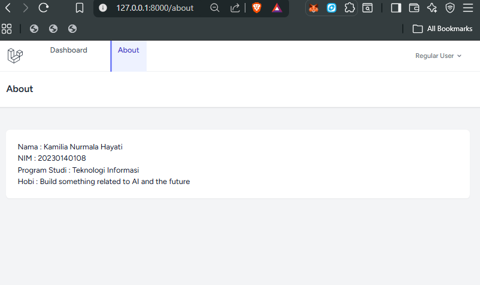

#### Admin melihat menu Product di navigasi (dapat melihat tombol Delete untuk semua produk)
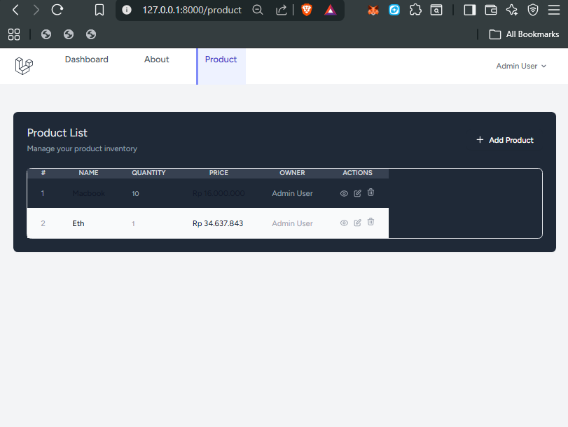

#### Policy: Tombol Edit & Delete hanya muncul untuk produk milik sendiri (regular user)
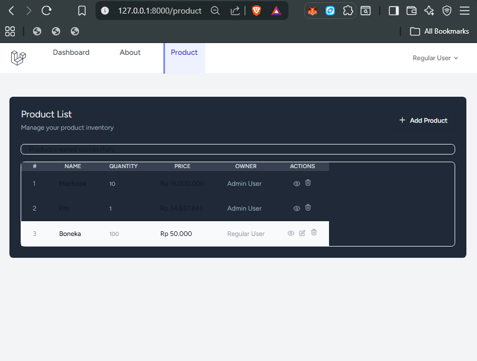

### Database sqlite sebelum diubah role
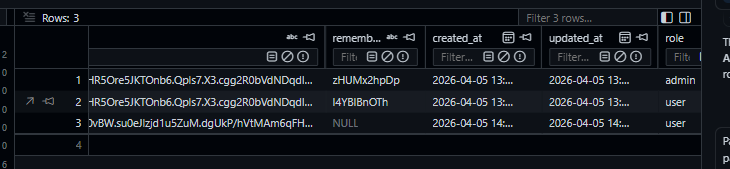

#### Change role user menjadi admin dan Database sqlite
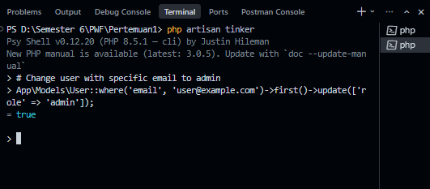

#### Policy: Regular user mendapat 403 saat coba edit produk milik orang lain
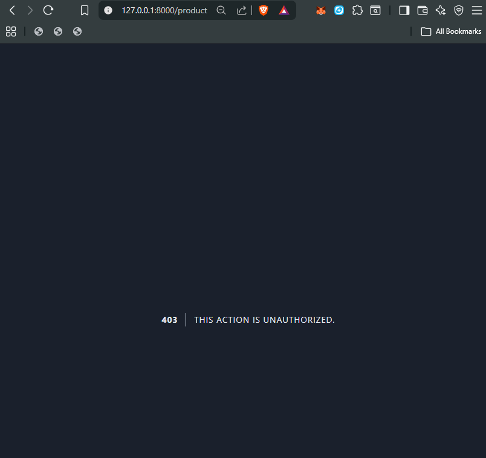

## Pertemuan 6: Laravel Validation
Validasi dengan custom error message pada method `store()` dan `update()`.

### 1. Validasi field nama produk kosong
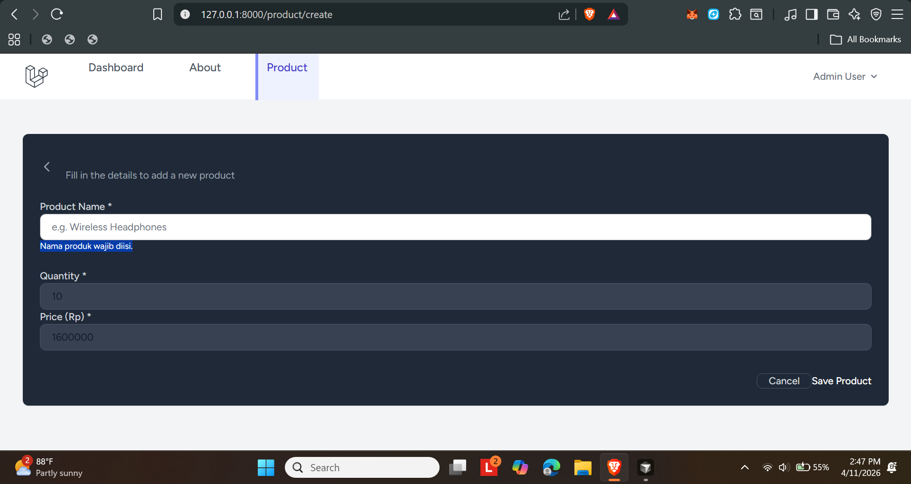

### 2. Validasi quantity dengan nilai desimal (harus integer)
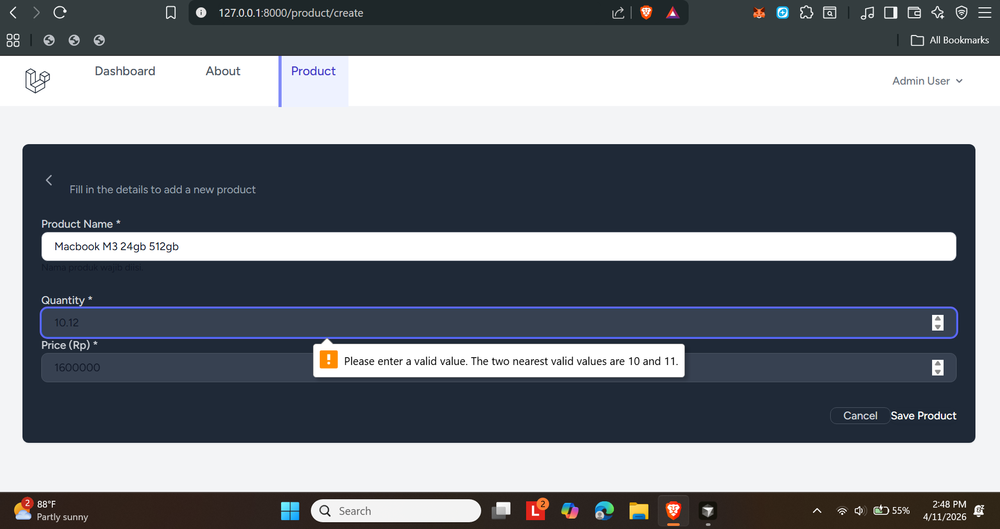

### 3. Validasi field harga kosong
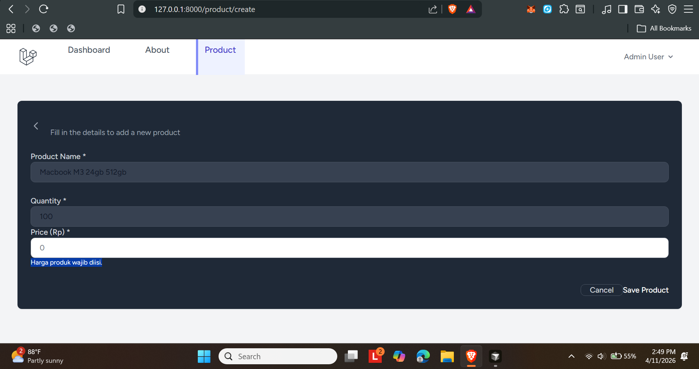

### 4. Success message setelah produk berhasil dibuat/diupdate
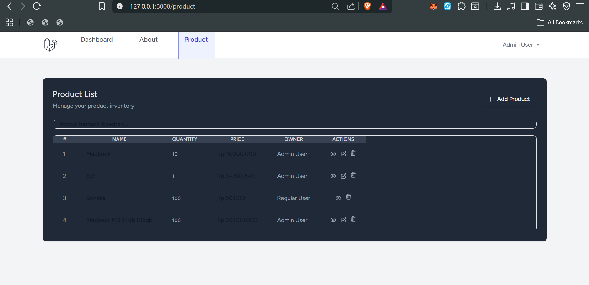

### 5. Error handling saat terjadi kesalahan database
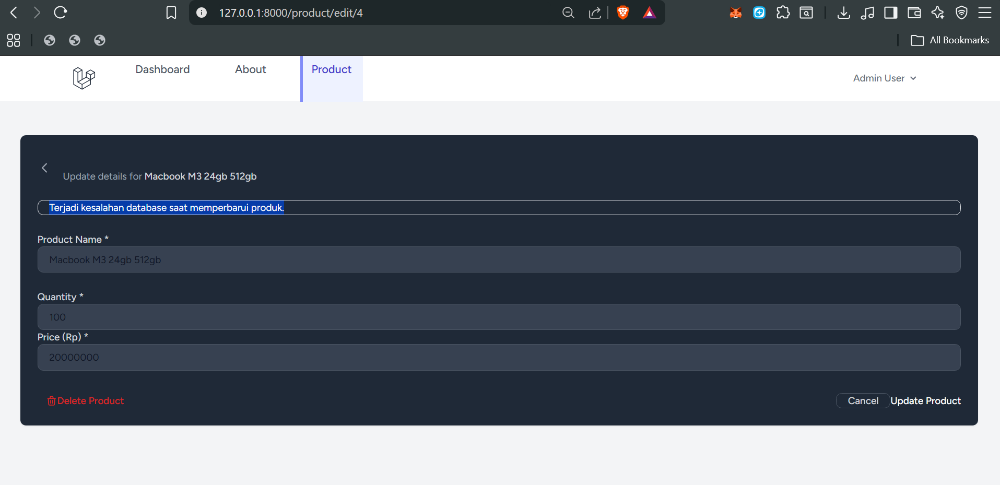

## Pertemuan 7: Laravel View Components
Membuat reusable components untuk tombol-tombol di aplikasi agar kode lebih bersih dan maintainable.
### Components yang Dibuat
#### 1. AddProduct Component
Component untuk tombol "Add Product" dengan parameter `url` dan `name`.
- File: `app/View/Components/AddProduct.php`
- View: `resources/views/components/add-product.blade.php`
#### 2. EditButton Component
Component untuk tombol Edit di halaman Product Detail dengan parameter `url`.
- File: `app/View/Components/EditButton.php`
- View: `resources/views/components/edit-button.blade.php`
#### 3. DeleteButton Component
Component untuk tombol Delete dengan form POST method (simulasi DELETE) dan confirm dialog.
- File: `app/View/Components/DeleteButton.php`
- View: `resources/views/components/delete-button.blade.php`
### Penerapan Component di View
#### Pada index.blade.php (AddProduct):
```blade
@can('manage-product')
    <x-add-product :url="route('product.create')" :name="'Product'" />
@endcan
```

### Pada view.blade.php (Edit & Delete):
```blade
<div class="flex items-center gap-2">
    @can('update', $product)
        <x-edit-button :url="route('product.edit', $product)" />
    @endcan
    @can('delete', $product)
        <x-delete-button :url="route('product.delete', $product->id)" />
    @endcan
</div>
```
---

**Nama:** Kamilia Nurmala Hayati  
**NIM:** 20230140108  
**Program Studi:** Teknologi Informasi
