## Pertemuan 1: Laravel Basic Setup
- Welcome Page dengan Nama, NIM, dan tombol navigasi
- Laravel Breeze (Login & Register)

### Screenshot UI
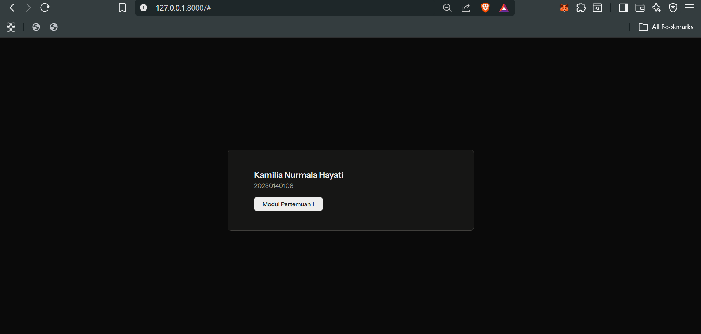
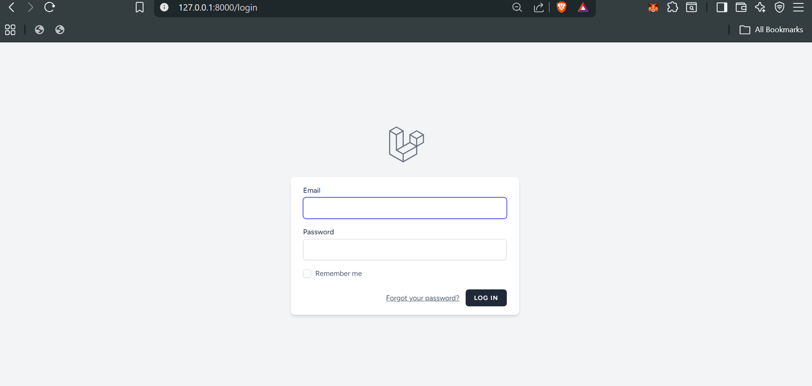
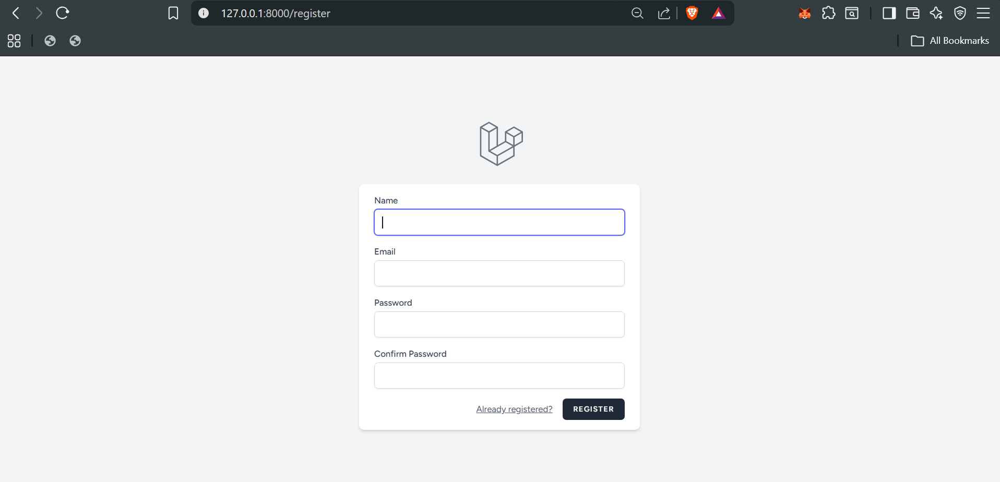
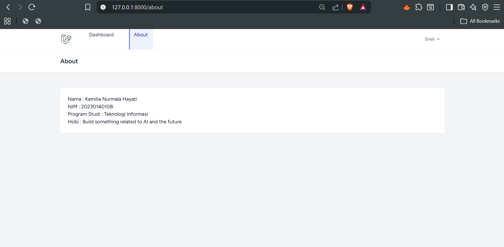

## Pertemuan 2: Breeze & Routing
- Route `/about` dengan Controller
- Navigation link di Dashboard
- Biodata: Nama, NIM, Program Studi, Hobi

## Pertemuan 3: ERD, Model & Migration Database

### ERD Structure
- **User**: id, name, email, password
- **Product**: id, user_id, name, qty, price
- **Category**: id, product_id, name

### Model
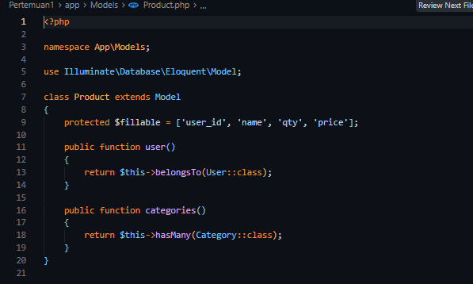
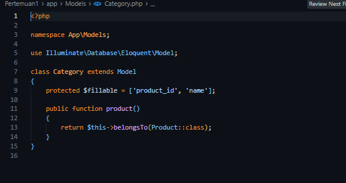
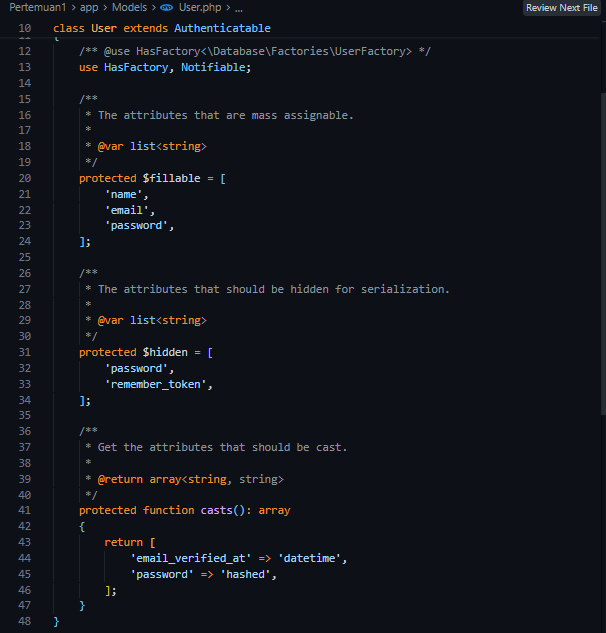

### Migration
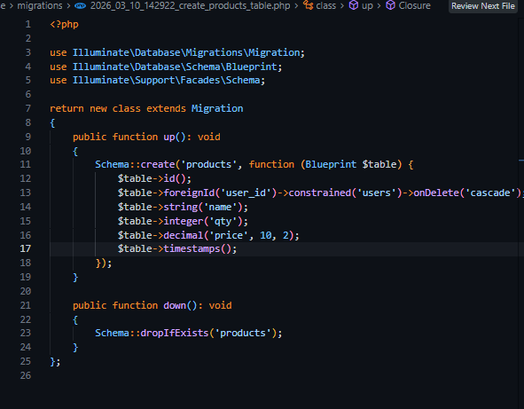
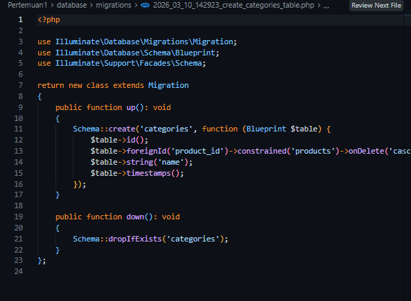

### Database (MySQL via XAMPP)
> Note: Beberapa tabel tambahan (cache, jobs, sessions, dll) adalah default Laravel yang otomatis dibuat oleh migration bawaan.

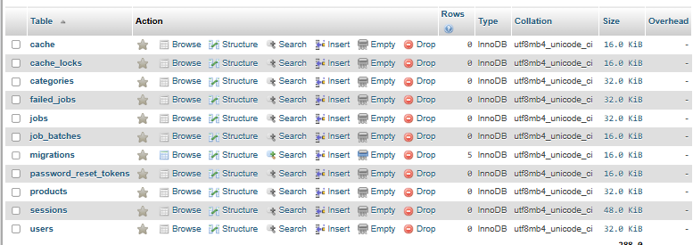
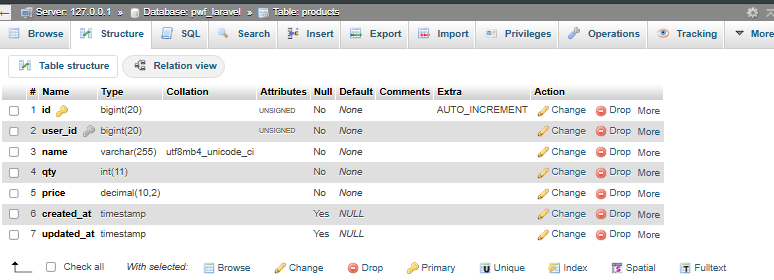
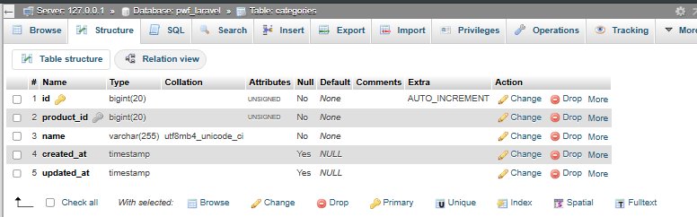
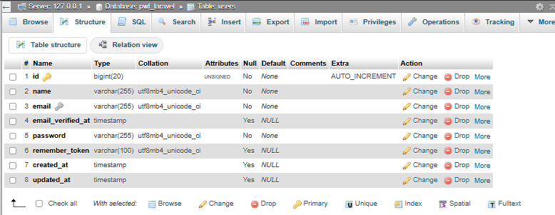

---

**Nama:** Kamilia Nurmala Hayati  
**NIM:** 20230140108  
**Program Studi:** Teknologi Informasi